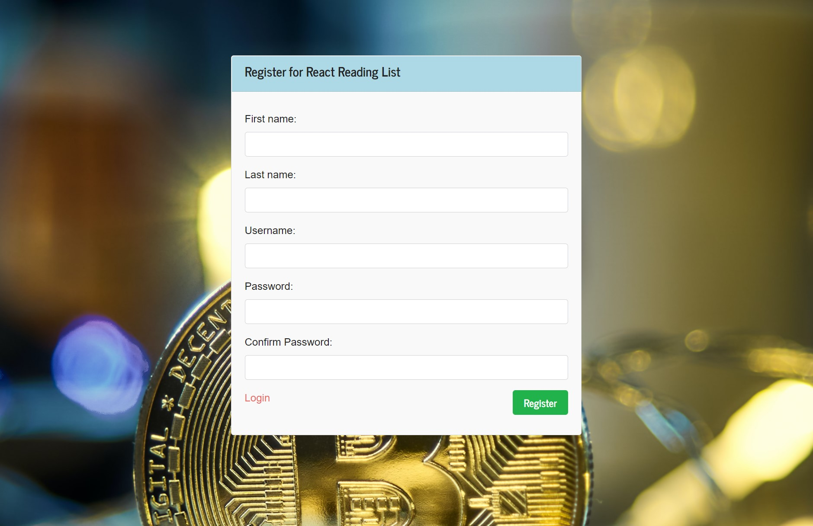
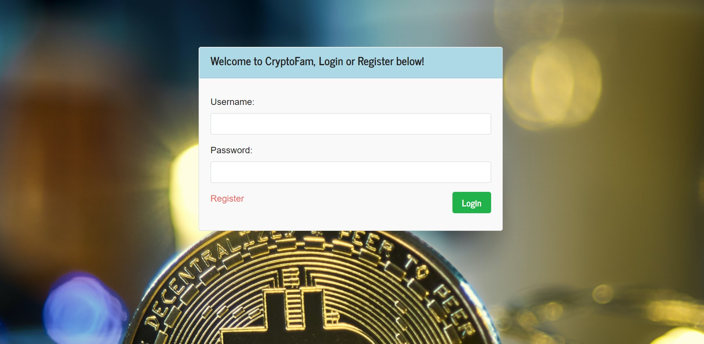
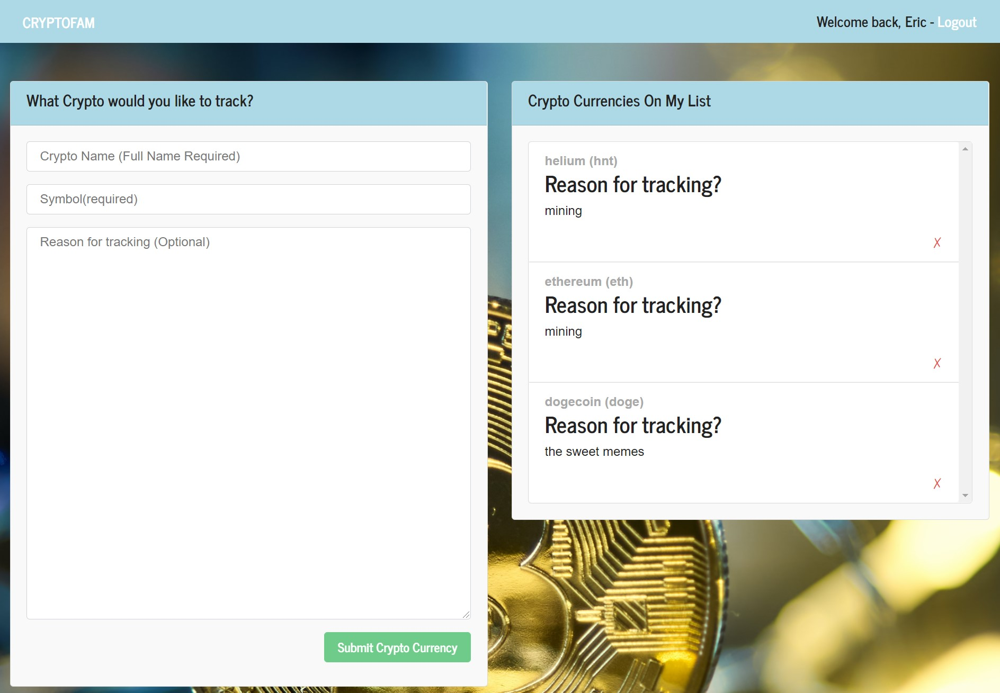
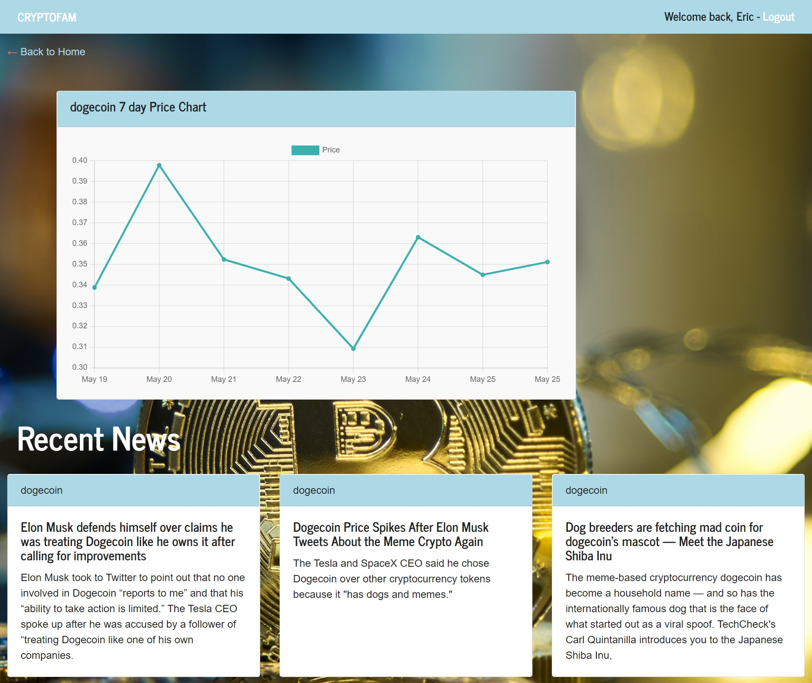

# CryptoFam

CryptoFam is a web app that let's you quickly search for and find your favorite Cryptos! You can see recent price trends on a 7 day graph and get recent news updates related to your favorite cryptos.

<a href = "https://evening-reaches-40912.herokuapp.com/">Here is a link to CryptoFam</a>

## Using CryptoFam

To use CryptoFam, you will need to go to the main landing page (listed above), and click register if you are a first time user. Otherwise you can select to login with your email and password. Selecting register will take you to the registration page where you create your account. You will now be at your profile page. Existing cryptocurrencies that you already added to your list will appear on the right side of the page (as they are stored using MongoDB). The left hand side of the page exists for you to add new cryptocurrencies to your list. You can add the crypto's name, it's ticket symbol, then add a ntoe for yourself regarding why you're tracking it. Selecting a cryptocurrency from the right hand list will take you to that crypto's information page, where you see recent price action along with top news relating to that crypto.

## Screenshots

## Contributors

- Joshua Coleman (https://github.com/9314610Jc)
- Eric Ellis (https://github.com/eellis4500)
- Devon Williams (https://github.com/Dwill629)  
- Stephen Wright (https://github.com/wrightsah)  

## Credits

The following resourses were used in the creation of this project:

APIs
- 

### Other websites

- https://stackoverflow.com/
- https://www.w3schools.com/
- https://www.heroku.com/
- https://www.screentogif.com/
- https://github.com/
- https://unsplash.com/

## License

This project uses the following license: MIT License Copyright(c) 2021
